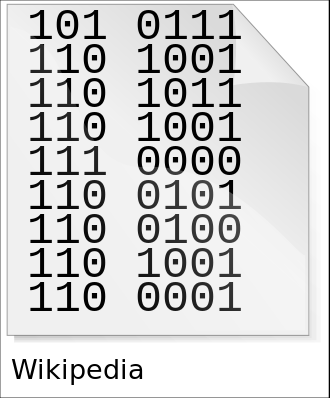
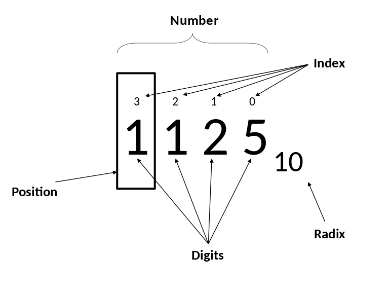
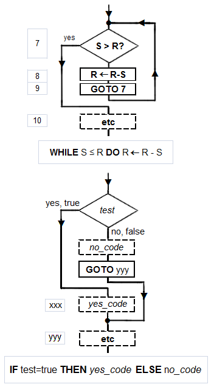

# 第二次作业

## 进制转换

1. 1分12秒 = 72000 毫秒
2. (7A)13 = (101)10
3. (7A)16 = (122)10
4. (7A)16 = (1111010)2 = (172)8
5. (1011011)2 = (133)8 = (5B)16
6. (678)10 = (1010100110)2 = (1246)8
7. (111)2 + (101)2 = (1100)2

## 名词解释

### 1)Information

**Explanation:**
> *Information* is any entity or form that provides the answer to a question of some kind or resolves uncertainty.

The ASCII codes for the word "Wikipedia" represented in binary, the numeral system most commonly used for encoding textual computer information.

### 2)Positional notation
**Explanation:**
> Positional notation or place-value notation is a method of representing or encoding numbers. 

Glossary of terms used in the positional numeral systems.

### 3)Algorithm
**Explanation:**
> an algorithm is an unambiguous specification of how to solve a class of problems. Algorithms can perform calculation, data processing and automated reasoning tasks.

Flowchart of an algorithm.

### 4)Software bug
**Explanation:**
> A software bug is an error, flaw, failure or fault in a computer program or system that causes it to produce an incorrect or unexpected result, or to behave in unintended ways.

## 写出以下概念的英文单词：

1. 十进制：Decimal
2. 二进制：Binary
3. 八进制：octonary(Octal)
4. 十六进制：Hexadecimal(Hexa)
