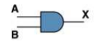
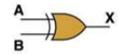
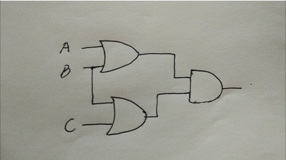
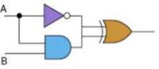
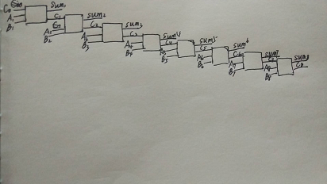

# 第五次作业

## 一、
### 1） Give the three representations of an AND gate and say in your words what AND means.
1. Boolean Expression: X = AB 
2. Logic Diagram Symbol:

    

3. Truth Table:

 A | B | X  
---|:--:|---:
 0 | 0 | 0  
 0 | 1 | 0
 1 | 0 | 0
 1 | 1 | 1

 And means:只有当A、B都为1时，X为1；否则为0。

 ### 2) Give the three representations of an XOR gate and say in your words what XOR means.
1. Boolean Expression: X = A ⊕ B 
2. Logic Diagram Symbol:

    

3. Truth Table:

 A | B | X  
---|:--:|---:
 0 | 0 | 0  
 0 | 1 | 1
 1 | 0 | 1
 1 | 1 | 0

 Xor means:若A、B相同，值为0；不同则为1。

 ### 3) Draw a circuit diagram corresponding to the following Boolean expression: (A + B)(B + C)
 

 ### 4) Show the behavior of the following circuit with a truth table:
 

 Boolean Expression: A’ ⊕ AB
 Truth Table：
 A | B | A’ | AB | A’ ⊕ AB
---|:--:|:--:|:--:|---:
 0 | 0 | 1  | 0  | 1 
 0 | 1 | 1  | 0  | 1  
 1 | 0 | 0  | 0  | 0 
 1 | 1 | 0  | 1  | 1

###  5) What is circuit equivalence? Use truth table to prove thefollowing formula.
(AB)’ = A’ + B’ 
 A | B | AB | A’ | B’ | (AB)’ | A’+B’ 
---|:--:|:--:|:--:|:--:|:--:|---:
 0 | 0 | 0  | 1  | 1  | 1     | 1
 0 | 1 | 0  | 1  | 0  | 1     | 1
 1 | 0 | 0  | 0  | 1  | 1     | 1
 1 | 1 | 1  | 0  | 0  | 0     | 0

 ### 6) There are eight 1bit full adder integrated circuits. Combine them to 8bit adder circuit using the following box diagram.

### 7) Logical binary operations can be used to modify bit pattern. Such as (X8X7X6X5X4X3X2X1)2 and (00001111)2 = (0000X4X3X2X1)2 We called that (00001111)2 is a mask which only makes low 4 bits to work.Fill the follow expression

1. (X8X7X6X5X4X3X2X1)2 or (00001111)2 = **(X8X7X6X51111)2**
2.  (X8X7X6X5X4X3X2X1)2 xor (00001111)2 = **(X8’X7’X6’X5’X4X3X2X1)2**
3.  ((X8X7X6X5X4X3X2X1)2 and (11110000)2 ) or (not (X8X7X6X5X4X3X2X)2 and (00001111)2) = **(X8X7X6X5X4X3X2X1)2**

## 二、使用维基百科，解释以下概念。
### 1)Logic gate
In electronics, a logic gate is an idealized or physical device implementing a Boolean function; that is, it performs a logical operation on one or more binary inputs and produces a single binary output.
### 2)Boolean algebra
In mathematics and mathematical logic, Boolean algebra is the branch of algebra in which the values of the variables are the truth values true and false, usually denoted 1 and 0 respectively.

## 三、自学存储电路。维基百科：“Flip-flop”，选择中文：
### 1)Flip-flop 中文翻译是？
触发器

    中国大陆译作“触发器”、台湾及香港译作“正反器”
### 2)How many bits information does a SR latch store?
I guess 3 bits.

