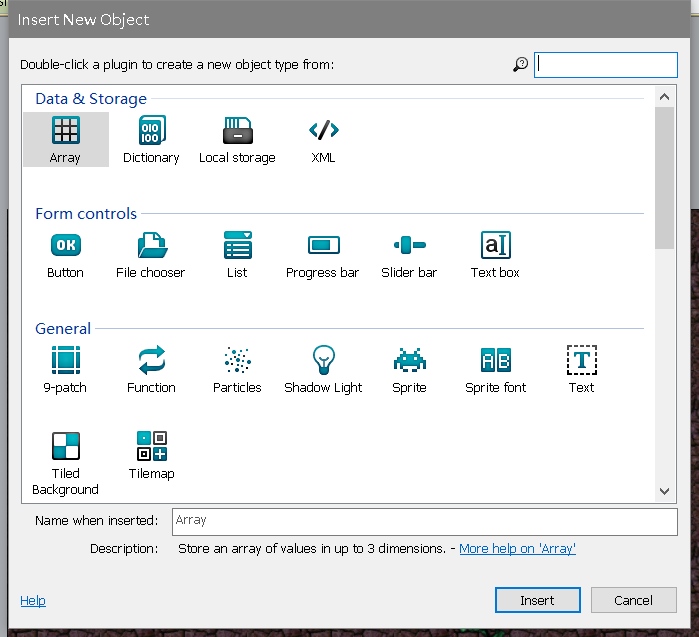

# Construct 2：第一个小游戏

这是我第一次使用Construct 2去制作游戏，所以跟着教程完成了一个游戏，并通过进一步学习改进游戏的交互性。

下面是制作过程的记录（省略了安装步骤与打开文件步骤）：

***

## 制作前设计

### 1）效果展示

我制作的游戏效果图如下：

### 2）架构设计

观察此效果图，我们需要三个部分：背景，游戏主体，用户交互。
为此我新建了三个图层，以分别放置这三部分（下面会详细介绍）。

### 3）具体对象

在此游戏中又需要具体的对象来实现，观察效果图，可以大概了解到有这几类对象：**player**,**monster**,**bullet**,**bakground**,**text**,**explode**。

由于我们使使用键盘与鼠标进行游戏，所以必须增加两个对象：**mouse**,**keyboard**。

### 4）行为与事件

首先每个对象都有各自的*行为*：
1. **player**需要受玩家的控制去移动与发射子弹。
2. **bullet**需要做子弹运动。
3. **monster**需要向玩家逼近。
4. **background**保持不动。
5. **text**需要在适当的时候出现。
6. **explode**爆炸之后会渐渐消失。

然后是事件，*事件*就是发生了某个事件会引发各个对象做不同的*行为*。

例如：子弹碰到怪兽，怪兽的生命值会减少。

***

## 具体实现

### 1. 插入对象（Object）

**双击空白处**，选择不同对象类型，以插入不同对象。

*注意*：此时我们首先设置最底部的图层background，所以只插入background，并把此图层命名为Background。

接下来新建一个名为Main的图层，点击+来新建。

此时就可以插入游戏主体部分的对象：**player**,**monster**,**bullet**和**explode**。将他们选为Sprite对象。

还要添加必要的text对象。

*注意*：另一种插入精灵对象的快捷方法是将图像文件从Windows拖放到布局区域。构造2将为您创建具有该纹理的Sprite。一定要一次拖动每个图像 - 如果你一次拖动所有四个图像，Construct 2将生成一个带有四个动画帧的Sprite。

### 2. 添加行为（Behaviour）

如图，我为player添加了三个行为以适应用户的操作。

接下来是为各个对象添加行为：
>- Add the Bullet movement and Destroy outside layout to the Bullet object (no surprises there)
>- Add the Bullet movement to the Monster object (because it just moves forwards as well)
>- Add the Fade behavior to the Explosion object (so it gradually disappears after appearing). By default the Fade behavior also destroys the object after it has faded out, which also saves us having to worry about invisible Explosion objects clogging up the game.

*注意*：按住**ctrl**并拖动对象可以copy多个同样的对象，我们以此来创建更多的monster。

### 3. 事件（Event）

首先，单击顶部的“事件表1”选项卡以切换到“事件表”编辑器。

>- 事件由条件组成，测试是否满足某些条件，例如“空格键是否已关闭？”。如果满足所有这些条件，则事件的所有操作都会运行，例如“创建项目符号对象”。运行后，任何子事件也会运行 - 然后可以测试更多条件，然后运行更多操作，然后运行更多子事件，等等。使用此系统，我们可以为我们的游戏和应用程序构建复杂的功能。但是，我们不需要本教程中的子事件。
>- 让我们再说一遍。简而言之，事件基本上如下所示：
>- 是否符合所有条件？
 ---> 是：运行所有事件的动作。
 ---> 否：转到下一个事件（不包括任何子事件）。
>- 这有点过于简单了。Construct 2提供了许多事件功能，可以涵盖您可能需要执行的许多不同操作。但是，就目前而言，这是一个思考它的好方法。

在介绍各种事件的添加之前，先介绍一下变量

### 4. 变量 

#### 实例变量

实例变量允许每个怪物存储自己的健康值。变量只是一个可以改变（或变化）的值，它们是为每个实例（对象）单独存储的，因此是名称*实例变量*。

添加一个生命值给monster：

#### 全局变量

在Event sheet1中右键选择Add Global number:

### 5. 综合应用

接下来是游戏实现最重要的一步，也就是之前所说的*事件*的实现。

#### 1. 游戏的开始

添加的动作：
* monster向随机方向运动。
* 一些文字设置为不显示。

#### 2. 每一时刻

添加的动作：
* player随鼠标转动。
* 显示得分，分数由Global number记录。

#### 3. 鼠标点击

添加的动作：
* player发射子弹（需要为player添加一个imagepoint，以使子弹在枪口射出）。

#### 4. 游戏实现

具体什么事件什么action我就不一一诉说了，只介绍完成了什么需求：
* 子弹碰到怪兽，怪兽生命值-1，当怪兽生命值小于0时，怪兽死亡，怪兽速度增加。
* 怪兽离开layout窗口会自动改变方向，指向玩家，且当怪兽与玩家距离小于20时会指向玩家。
* 每3秒，增加一只怪兽，怪兽速度更新。
* 怪兽碰到玩家，玩家死亡，展示游戏结束界面。

#### 5. 游戏结束

游戏结束展示：

此时按空格键，分数置零，怪兽速度初始化，游戏重新开始。

***
## 总结

### 不足：
* 没有制作游戏开始界面。
* 游戏对象仍不够智能。
* 没有插入音效与BGM。
* 不能由用户自定义游戏难度。
* 可玩性不高，没有为玩家提供道具，等级升级等功能。

### 认识：
* Construct 2是一款不需要编程就能制作2D游戏的开发软件，它的可视性很强，将抽象化的代码变得很具体。
* 游戏开发需要明确需求，预先设计好方案，最后再利用工具实现，利用一个不用编程且素材丰富的工具开发游戏都需要大量精力，可见真正的游戏开发是非常大的工程，真心敬佩游戏开发者。

