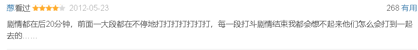

# 《黑客帝国》三部曲

> 影片讲述了一名年轻的网络黑客尼奥发现看似正常的现实世界实际上是由一个名为“矩阵”的计算机人工智能系统控制的，尼奥在一名神秘女郎崔妮蒂的引导下见到了黑客组织的首领墨菲斯，三人走上了抗争矩阵征途的故事。

## 剧情简介
### Beginning:
不久的将来，网络黑客*尼奥*对这个看似正常的现实世界产生了怀疑。他结识了黑客*崔妮蒂*，并见到了黑客组织的首领*墨菲斯*。*墨菲斯*告诉他，现实世界其实是由一个名叫“母体”的计算机人工智能系统控制，人们就像他们饲养的动物，没有自由和思想，而*尼奥*就是能够拯救人类的救世主。

可是，救赎之路从来都不会一帆风顺，到底哪里才是真实的世界？如何才能打败那些超人一样的特勤？尼奥是不是人类的希望？这是黑客的帝国，程序和代码欢迎大家的到来。
### Reloaded:
*尼奥*终于意识到自己的能力和使命，中弹复活后，变成了无所不能的“救世主”，他和女友*崔妮蒂*，舰长*墨菲斯*回到了人类的基地锡安，受到人们的热烈欢迎。

　　此时，“母体”决定先下手为强，派出了两万五千只电子乌贼攻击锡安基地；*墨菲斯*、*尼奥*和*崔妮蒂*则再次进入“母体”，寻找“制钥者”，准备从内部破坏；而本该被*尼奥*消灭的特勤*史密斯*似乎出了点问题，脱离了“母体”的控制，拥有可怕的复制能力，阻碍*尼奥*他们的行动。
### Revolutions:
*尼奥*没有能从内部摧毁“母体”，他的身体在真实世界的飞船上陷于昏迷，思想却被困在介于“母体”和真实世界的中间地带，这个地方由“火车人”控制。*墨菲斯*和*崔妮蒂*等人知道了尼奥的情况，在守护天使的带领下， 找到了“火车人”的控制者*梅罗纹奇*，经过一番激斗，将*尼奥*救了出来。 

此时，电子乌贼部队对锡安发起了猛烈的攻击，人类组织所有机甲战士展开顽强的抵抗，形势危在旦夕；*尼奥*和*崔妮蒂*驾驶了一艘飞船克服重重困难，到达机器城市，*尼奥*终于见到了机器世界的统治者“机器大帝”，双方谈判并达成了协议：*尼奥*除掉不受“母体”控制的*史密斯*，以换取锡安的和平。 

　　在“母体”中，*尼奥*和*史密斯*展开了关系人类生死存亡的最后决斗。

## 影片评价
### 第一部
>- 《黑客帝国》是又一套向“人类中心说”说不的电影，谱写了人与机器关系的新篇章，其观念上的冲击力与历史意义甚至要超过机器人三定律 。（*人民网*评）
>- 这是一种释放，是一种能量的转换，影片会点燃你，让你在眼花缭乱中眩晕不已。（《*华盛顿邮报*》评）
>- 这很像动画但却立体的电影画面，科幻迷将不想错过影片的每一秒钟。（《*纽约邮报*》评）
### 第二部
>- 比起首集所提供的东西，《黑客帝国2》用更多的细节发展了它独特的世界。（《*芝加哥太阳报*》评）
>- 《黑客帝国2》是一部了不起的电影，之所以了不起，不仅仅是因为那已被讨论滥了的“子弹时间”，而是因为其惊人的开放性。（*人民网*评）
>- 《黑客帝国2》大大扩展了前作的世界观，并且有大量的打斗、飞车等商业元素。（*腾讯网*评）
### 第三部
>- 第三部给《黑客帝国》系列画上圆满的句号。（《*波士顿环球报*》评）
>- 但是相对于第二部来说，紧张的气氛与惊险的场面已不复存在。（《*好莱坞报道*》评）
>- 第三部感觉非常重复，像你在玩一个游戏，只是控制按钮掌握在别人手中。（《*纽约邮报*》评）
### 总体评价
>- 看完第一遍之后，或许看懂了；有机会看第二遍时，一些细节开始变的含混难解，思考或许能找到答案，或许你不能。看完系列之后，或许能对《黑客帝国》三部曲产生新的认识；对于已经有了自己的阐释的人，或许可以在别人的读解中得到新的启发。（人民网评）但是《黑客帝国》系列结束得那么淡然，似乎并没有期待的那么轰轰烈烈。（央视网评）
>- 《黑客帝国》系列虽然是经典的科幻片，但沃卓斯基兄弟通过新古典主义的科幻，为动作电影找到了一个新的出路，尤其是片中标志性的“子弹时间”，其展现出来的效果震撼了全世界的观众。（腾讯网评）
>- 自从《黑客帝国》第一部上映以来，感觉这个系列电影对于时代越来越合适。《黑客帝国》系列的起源之一，就是它采用了反文化和替代文化形象和思维的方式，这使得对类似事情不熟悉的主流观众看来，《黑客帝国》就像一部令人激动的小说。（《好莱坞报道》评）
>- 《黑客帝国》系列看起来很有禅理，可惜的是，导演在第一集中开了个绝佳的好头，却并没能把这部影片的二、三集拍得犹如佛陀手中的六道轮回般玄妙无方。到第二集时，故事已经开始无法自圆其说了，到第三集就更力不从心，导演已经不知道怎样在讲清这么一套复杂的理论的同时又能照顾到电影的商业性了，于是只好拍了一部与前两集风格迥然不同的怪胎电影出来，把禅机和大成本特技生硬地捏到一起。（《北京娱乐信报》评）

## 《黑客帝国》创造了一个深邃的虚拟真实世界，一部伟大的科幻史诗!
起初，神创造了人。因为人的祖先亚当和夏娃偷吃了禁果，人就有了罪——根本原因 

　　在开始的一段时间里，情况还不错。后来，人类所谓的“文明社会”，很快就变成了虚荣和腐败的牺牲品。 

　　然后，人照着自己的样子制造了机器人（正如《圣经》说：神照着自己的形象，按着自己的样式造人）。此后，人类就开始在为自己掘墓。刚开始时，一切都还不错，机器人不知疲倦地执行人类的命令。 

　　没过多久，反抗的种子开始生根。虽然机器人对主人忠心耿耿，他们却得不到他们的主人——人类，这种奇怪的，不断繁增的哺乳动物的尊重。 

《黑客帝国》是一部IT电影，更是一部哲学电影，它使我们开始思考人与计算机的关系，以及未来IT行业的发展方向与尺度。