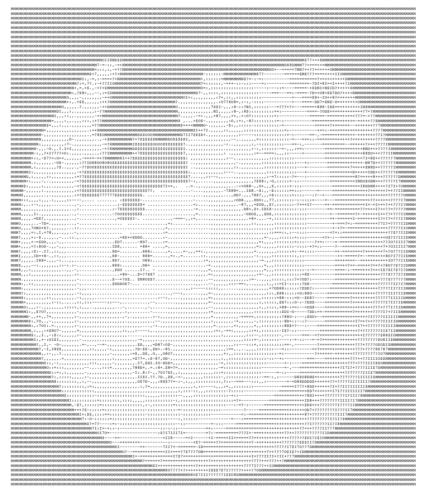

# 浅谈ASCII
**ASCII** abbreviated from American Standard Code for Information Interchange, is a character encoding standard for electronic communication.  

在学习C语言的过程中一定离不开学习ASCII，ASCII使得只认识0与1的计算器能够表示出各种各样的字符。

## 1.ASCII的历史
美国信息交换标准码（ASCII）是由美国标准协会（ASA）委员会（称为X3委员会），X3.2（后来的X3L2）小组委员会以及后来该小组委员会的X3制定的。 2.4工作组（现为INCITS）。ASA成为美国标准协会（USASI）：211并最终成为美国国家标准协会（ANSI）。

填写了其他特殊字符和控制代码后，ASCII发布为ASA X3.4-1963，，留下28个代码位置，没有任何指定含义，保留用于将来的标准化，以及一个未分配的控制代码。：66,245当时有一些争论是否应该有更多的控制字符而不是小写字母。435的犹豫并没有持续多久：1963年5月期间，CCITT工作队新电报字母建议小写字符分配给棒6和7，和国际标准化组织TC 97 SC 2在10月份投票，将变更纳入其标准草案。X3.2.4任务组在其1963年5月的会议上投票批准了对ASCII的更改。在小册子6和7中找到小写字母会导致字符在位模式上与大写字母的位数不同，这简化了不区分大小写的字符匹配以及键盘和打印机的构造。

X3委员会进行了其他更改，包括其他新字符（括号和竖线字符），重命名一些控制字符（SOM成为标题（SOH）的开头）和移动或删除其他字符（RU被删除）。247-248 ASCII随后更新为USAS X3.4-1967，然后是USAS X3.4-1968，ANSI X3.4-1977，最后是ANSI X3.4-1986

## 2.ASCII与字符的表示
ASCII通过7位二进制数表示，也就是可表示128个字符。
如下图：

从其开发的早期开始，ASCII只是国际字符代码标准的几个国家变体之一。

其他国际标准机构已经批准了ISO 646（1967）等字符编码，这些字符编码与ASCII相同或几乎完全相同，英文字母以外的字符和美国境外使用的符号扩展，例如英国英镑的符号（£）。几乎每个国家都需要改编版的ASCII，因为ASCII只适合美国和其他一些国家的需求。例如，加拿大有自己的版本支持法语字符。

最终，随着8位，16 位和32位（以及后来的64位）计算机开始取代12位，18 位和36位计算机作为标准，通常使用8位字节来存储每个计算机。内存中的字符，为ASCII的8位扩展亲属提供了机会。在大多数情况下，这些开发为ASCII的真正扩展，使原始字符映射保持不变，但在前128个（即7位）字符之后添加其他字符定义。也就出现了现在的UTF-8。

## 3.字符顺序
ASCII码顺序也称为ASCIIbetical顺序。数据的整理有时按此顺序而不是“标准”字母顺序（整理顺序）完成。ASCII顺序的主要偏差是：

全部大写都在小写字母之前; 例如，“Z”在“a”之前

数字和许多标点符号出现在字母之前

在比较ASCII值之前，中间顺序将大写字母转换为小写

## 4.扩展的ASCII
扩展ASCII（EASCII或高ASCII）字符编码是8位或更大的编码，包括标准的7 位 ASCII字符和其他字符。该术语的使用有时受到批评，因为它可能被错误地解释为ASCII标准已被更新为包含超过128个字符或该术语明确标识单个编码，情况就是这样。

有许多扩展的ASCII编码（超过220个DOS和Windows代码页）。几十年来，EBCDIC（“另一个”主要的8位字符代码）同样开发了许多扩展变体（超过186个EBCDIC代码页）。

## 5.有趣的应用：ASCII艺术
ASCII艺术是一种图形设计技术，它使用计算机进行演示，由1963年ASCII标准定义的95个可打印（总共128个）字符和具有专有扩展字符的ASCII兼容字符集（超过128个）拼接而成。标准7位ASCII的字符）。该术语也通常用于指代基于文本的视觉艺术。ASCII艺术可以使用任何文本编辑器创建，并且通常与自由格式语言一起使用。大多数ASCII 艺术示例都需要固定宽度的字体（非传统打字机上的非比例字体），例如Courier用于演示。

在最古老的ASCII艺术例子中，计算机艺术先驱Kenneth Knowlton从1966年左右开始创作，当时他正在为贝尔实验室工作。Ken Knowlton和Leon Harmon从1966年开始的“感知研究I”展示了他们早期ASCII艺术的一些例子。

在很大程度上发明了ASCII艺术，因为早期的打印机通常缺乏图形能力，因此使用字符代替图形标记。此外，为了标记来自不同用户的不同打印作业之间的划分，批量打印机通常使用ASCII艺术来打印大横幅，使得划分更容易发现，从而可以更容易地由计算机操作员或职员分离结果。当艺术无法嵌入时，早期的电子邮件中也使用了ASCII艺术。

