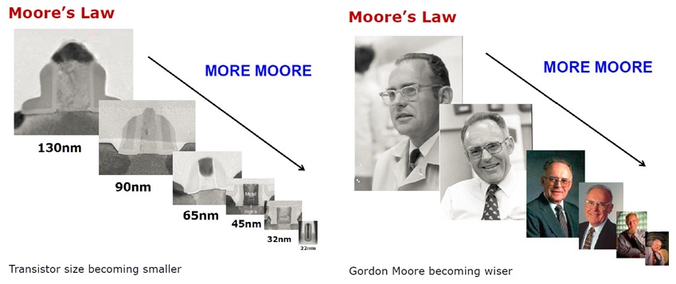
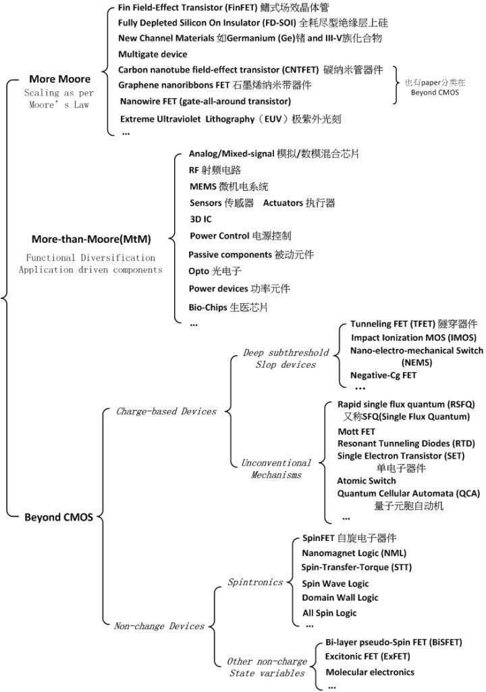

# 摩尔定律还有效吗?

## 什么是摩尔定律？

摩尔定律（英语：Moore's law）是由英特尔（Intel）创始人之一戈登·摩尔提出来的。其内容为：积体电路上可容纳的电晶体（晶体管）数目，约每隔两年便会增加一倍；经常被引用的“18个月”，是由英特尔首席执行官大卫·豪斯（David House）所说：预计18个月会将芯片的性能提高一倍（即更多的晶体管使其更快）。

半导体行业大致按照摩尔定律发展了半个多世纪，对二十世纪后半叶的世界经济增长做出了贡献，并驱动了一系列科技创新、社会改革、生产效率的提高和经济增长。个人计算机、因特网、智能手机等技术改善和创新都离不开摩尔定律的延续。

尽管摩尔定律的现象已经被观察到了数十年，摩尔定律仍应该被视为是对现象的观测或对未来的推测，而不是一个物理定律或自然界的规律，从另一角度看，未来的增长率在逻辑上无法保证会跟过去的數據一样，也就是逻辑上无法保证摩尔定律会持续下去。虽然预计摩尔定律将持续到至少2020年。然而，2010年国际半导体技术发展路线图的更新增长已经在2013年年底放缓；又比如说英特尔在22奈米跟14奈米的CPU制程上已经放慢了技术更新的脚步，之后的时间里，晶体管数量密度预计只会每三年增加一倍。

## 摩尔定律还能持续多久?
>随着新工艺节点的不断推出，晶体管中原子的数量已经越来越少，种种物理极限制约着其进一步发展。比如当闸极长度足够短的时候，量子隧穿效应就会发生，会导致漏电流增加。关于摩尔定律的终点究竟还有多远，看法并不一致。有预测认为摩尔定律的极限将在2025年左右到来，但也有更乐观的预测认为还能持续更久。AMD EPIC CPU 64C 128T (ES)已经遗反了

日前，摩根大通发布一份报告，揭露 ASML 有能力支撑工艺技术到 1.5 纳米节点，让摩尔定律续命至 2030 年，再度将该定律的“生命年限”推至风口浪尖上，因为当中攸关全球每一家半导体企业的竞争年限。

至于还能持续多久，这有关于是否能在别的方向上对芯片进行发展。

## 为摩尔定律续命是众人责任。
要拉长摩尔定律的生命年限也不单只是 ASML 一家企业的责任，整个半导体业界都倾全力前进，三星、英特尔、台积电也投入 FinFET 技术的下一代接班人环绕式闸极晶体管（Gate- all-around ; GAA）的技术开发，GAA 晶体管是场效晶体管（FET），在通道的四个侧面都有一个闸极，用于克服 FinFET 的实体微缩和性能限制。

其中，三星的态度非常积极，预计在 3 纳米工艺节点上导入，计划 2021 年量产。

半导体晶体管从平面排列，到 20 纳米以下转为 FinFET 鳍式排列的架构，未来 3 纳米工艺节点左右，又将转入 GAA 晶体管技术，大家的努力都是为了延长摩尔定律的有效时间。

此外，鳍式场效应晶体管（FinFET）和全耗尽型绝缘层上硅晶体管（FD-SOI）两大创新技术的发明人胡正明也成功延续摩尔定律的生命，FinFET 让高端技术走到 10/7/5 纳米以下，而 FD-SOI 开创一条主流技术以外的道路，且两大技术分别被英特尔、台积电、三星采用，也运用在苹果产品上。

胡正明曾经表示，以前技术是通过测量线宽来进行微缩，当半导体工艺走到 14/10/7 纳米节点，真正应该在意的是成本、速度、功耗、性能，而推动半导体微型化的方式不一定是减少尺寸，也可以朝 3D 技术下手。

钰创董事长卢超群也分析，半导体进入 FinFET 时代，工艺技术所代表的数字意义和实质线宽的微缩已脱勾，这就是为什么英特尔认为自家的 10 纳米技术，相当于等于台积电和三星的 16 /14 纳米工艺节点。

再者，封装测试技术的精进，目的也是为了延续摩尔定律效益。台积电十年前就低调布局封装测试领域，是看到摩尔定律的极限，经过多年的鸭子划水，台积电提出 CoWOS 和 InFO 两大封装技术，且苹果在 iPhone 的导入，携手成为续命摩尔定律的成功表率。

无论是台积电跨入后端封测布局、 FinFET 技术的开发、 ASML 将光刻机的技术蓝图推至 2030 年 1.5 纳米、三星提出环绕式闸极晶体管 GAA 架构等，大家的目的都是让全球 5,000 亿美元产值的半导体产业延续。

## 怎么办？
主要分为以下三个方向：
* “More Moore”、”“More than Moore”、“Beyond CMOS”

* “More Moore”做的是想办法沿着摩尔定律的道路继续往前推进。
* “More than Moore”做的是发展在之前摩尔定律演进过程中所未开发的部分。
* “Beyond CMOS”做的是发明在硅基CMOS遇到物理极限时所能倚重的新型器件。