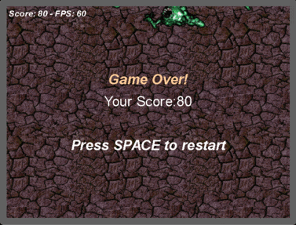

# 坦克大战怪兽

这是第一次利用constru 2去设计游戏，接下来就来看一下我的游戏吧！

## 效果展示

我制作的游戏效果图如下：

## 游戏策划
### 楔子(Setting)：
公元8102年，人类迎来重大毁灭，外来者怪兽大肆入侵地球。而你担起拯救地球的重担，阻止它们的入侵...

### 人设与道具（Game Sprites）：

Player：驾驶坦克，发射炮弹射击靠近的怪兽...

Moster：见到人类就疯狂毁灭，数目不断增加，一碰到玩家的坦克即将其毁灭，人类的命运到底如何...

## 游戏设计

### 1）架构设计

观察此效果图，我们需要三个部分：背景，游戏主体，用户交互。
为此我新建了三个图层，以分别放置这三部分（下面会详细介绍）。

### 2）具体对象

在此游戏中又需要具体的对象来实现，观察效果图，可以大概了解到有这几类对象：**player**,**monster**,**bullet**,**bakground**,**text**,**explode**。

由于我们使使用键盘与鼠标进行游戏，所以必须增加两个对象：**mouse**,**keyboard**。

### 3）行为与事件

首先每个对象都有各自的*行为*：
1. **player**需要受玩家的控制去移动与发射子弹。
2. **bullet**需要做子弹运动。
3. **monster**需要向玩家逼近。
4. **background**保持不动。
5. **text**需要在适当的时候出现。
6. **explode**爆炸之后会渐渐消失。

然后是事件，*事件*就是发生了某个事件会引发各个对象做不同的*行为*。

例如：子弹碰到怪兽，怪兽的生命值会减少。

### 4）CRC卡片
#### Player
**Object**:玩家

**Attribute**:图片,位置

**Collaborator**：精灵 **Events & Actions**：鼠标点击&射出子弹，碰到怪兽&自爆（死亡）

#### Monster
**Object**:怪兽

**Attribute**:图片,位置，血量：5

**Collaborator**：精灵 **Events & Actions**：每过5秒&不断滋生，靠近人类（玩家）&疯狂靠近，被子弹打中&血量减1，血量降为0&死亡并爆炸

#### Bullet
**Object**:子弹

**Attribute**:图片,位置

**Collaborator**：精灵 **Events & Actions**：碰撞&销毁自己

#### Explode
**Object**:爆炸

**Attribute**:图片,位置

**Collaborator**：精灵 **Events & Actions**：怪兽或玩家死亡&出现，过1秒&消失

#### Text
**Object**:Score&GameOverText&RestartText

**Attribute**:文字，位置

**Collaborator**：Text **Events & Actions**：游戏结束（玩家死亡）&出现在指定位置

**Object**:Status

**Attribute**:文字，位置

**Collaborator**：Text **Events & Actions**：怪兽死亡 & 分数加1并更新，位置不变

## 具体实现

参考02-制作 HTML5 游戏

## 总结

### 不足：
* 没有制作游戏开始界面。
* 游戏对象仍不够智能。
* 没有插入音效与BGM。
* 不能由用户自定义游戏难度。
* 可玩性不高，没有为玩家提供道具，等级升级等功能。

### 认识：
* Construct 2是一款不需要编程就能制作2D游戏的开发软件，它的可视性很强，将抽象化的代码变得很具体。
* 游戏开发需要明确需求，预先设计好方案，最后再利用工具实现，利用一个不用编程且素材丰富的工具开发游戏都需要大量精力，可见真正的游戏开发是非常大的工程，真心敬佩游戏开发者。

