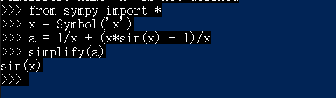
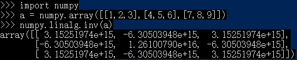
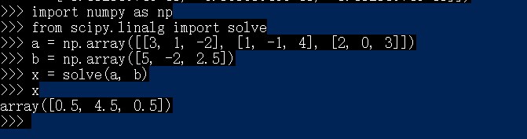

# python 编程实验报告

## 一、实验目的
1. 了解一种“解释型”语言 python
2. 使用 python 做一些简单的科学计算

## 二、实验环境
* 编程工具：Python（winpython / Anaconda）
* 操作系统：Windows (only)

## 三、高等数学问题
### 公式化简

公式化简想要创建一个符号化的变量x，然后创建一个符号方程，接着利用simplify()即可。

### 泰勒分解

泰勒分解也先要符号化变量，接着使用此变量写出你分解的函数，接着调用series(x, 0, 6)，表明求此函数关于x在x=0处的6级泰勒公式。

## 四、线性代数问题
### 逆矩阵

导入numpy的包， 接着调用scipy.linalg里的inv()即可求矩阵逆

### 解方程组

3x1 + x2 - 2x3 = 5

x1 - x2 + 4x3 = -2

2x1 + 3x3 = 2.5